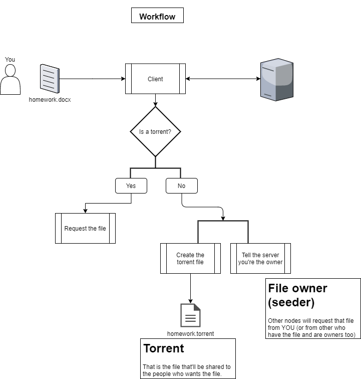
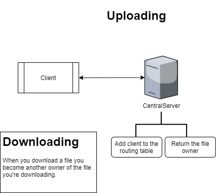
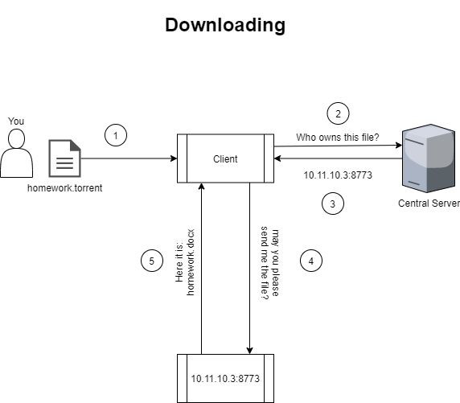

# P2P-File-Sharing


A P2P file sharing network.
The project stills under development, so if something is missing or its bad, don't worry, I'll take care of it.

# Index
- [How it works? ](#how-it-works)
- [How to install?](#how-to-install)
    - [Dependencies](#dependencies)
    - [Install from source](#install-from-source)
- [How to use?](#how-to-use)

## Todo list
- [X] Create the listen client daemon to send the requested file
- [ ] Make the seeder multi-client
- [X] Use the download folder
- [ ] Add a help sumary
- [ ] Add custom configuration through the command line
- [ ] Do soem code refactoring (readability)
- [ ] Use protobuf instead of JSON?

## How it works?
It's basically a BitTorrent-like network implementation. So you have those who have the file and provide it tho the other nodes (seeders) and the other who download the file and become seeders too. With a Centralized P2P architecture.

 
It uses a torrent file, that is basically a `JSON` format file that contains some file metadata.
The server does not provide the file itself, but just points/indexes to who owns the file, also it doesn't stores any single byte of the file in it.

Below we have a simple diagram showing how the client handles the creation of the torrent file.

 

 Also how the server reply you with the file owner `IP` and `PORT` and add you the file owner list.

 

 And finally how the download workflow is.

 

## How to install?
Choose from where you want and follow the instructions to install the program.

### Dependencies
Sure you need: `gcc/g++`, `make` and `cmake`. You can install all of them through `apt`.

Before installing make sure you have installed the following dependencies:
- cJSON
    - [From source](https://github.com/DaveGamble/cJSON#building)
    - Using `apt` on debian-based distros:
    
        `$ sudo apt update && sudo apt install libcjson-dev`

- libconfig
    - You can check it at their [website](https://hyperrealm.github.io/libconfig/) or at [github](https://hyperrealm.github.io/libconfig/)
    - Using `apt` on debian-based distros:

        `$ sudo apt update && sudo apt install libconfig-dev`

- libssl-dev
    - Using `apt` on debian-based distros:

        `$ sudo apt update && sudo apt install libssl-dev`

### Install from source:
```
$ git clone https://githubcom/FallAngel1337/P2P-File-Sharing
$ cd P2P-File-Sharing
```

After that you can configure the client and server through the config files located at `conf` folder.
Then continue with 
```
$ make
```

For now, you need to build both separately.
-  Building the client
    ```
    $ cd src/client/
    $ mkdir build
    $ cd build
    $ cmake ..
    $ make
    $ ./P2P-Client <file>
    ```

- Building the server (not working)
    ```
    $ cd src/server/
    $ mkdir build
    $ cd build
    $ cmake ..
    $ make
    $ ./P2P-Server
    ```
